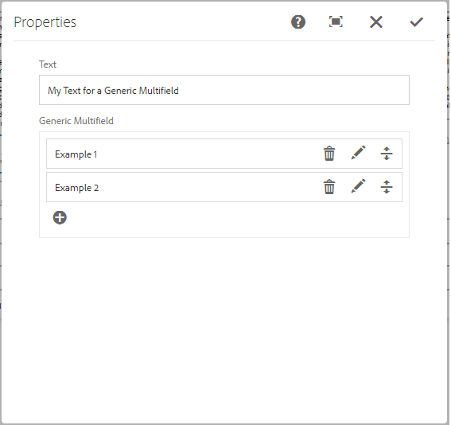
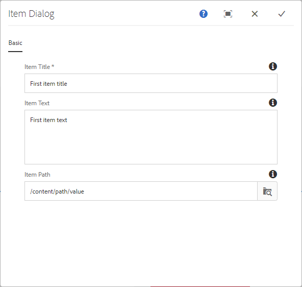
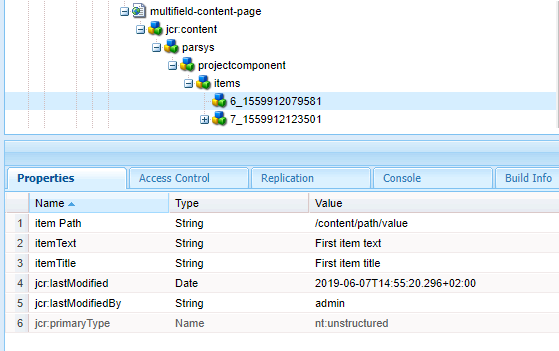

# Generic Multifield for AEM 6.4

System        | Status
--------------|------------------------------------------------        
CI master     | [![Build Status][travis-master]][travis-url]
CI develop    | [![Build Status][travis-develop]][travis-url]
Dependency    | [![Maven Central][maven-central-version]][maven-central]

With this project you can use a widget in [Adobe Experience Manager 6.4](https://helpx.adobe.com/experience-manager/6-4/release-notes.html) Touch UI which lets you create a generic multifield in a dialog.

## Usage

### Maven Dependency
```
    <dependency>
      <groupId>com.namics.oss.aem</groupId>
      <artifactId>genericmultifield</artifactId>
      <version>2.0.1</version>
    </dependency>
```

### in AEM
Since the Generic Multifield is built as an OSGi bundle, only the bundle has to be installed into your AEM instance. 
With the common AEM archetype it can be added within the embedded configuration of the "content-package-maven-plugin" plugin.
```xml
    <plugin>
        <groupId>com.day.jcr.vault</groupId>
        <artifactId>content-package-maven-plugin</artifactId>
        <extensions>true</extensions>
        <configuration>
            ...
            <embeddeds>
                <embedded>
                    <groupId>com.namics.oss.aem</groupId>
                    <artifactId>genericmultifield</artifactId>
                    <target>/apps/myProject/install</target>
                </embedded>
            </embeddeds>
        </configuration>
    </plugin>
```

 
#### Dialog
Use the Generic Multifield in your _cq_dialog.xml of a AEM 6.4 (with Touch UI) like this example:
```xml
    <genericmultifield
        jcr:primaryType="nt:unstructured"
        sling:resourceType="namics/genericmultifield"
        fieldLabel="Generic Multifield"
        itemDialog="path/to/a/item-dialog"
        itemStorageNode="items"
        itemNameProperty="title"
        name="./items"
        minElements="3"
        maxElements="5"
        required="{Boolean}true" />
```

Example dialog:



#### Item-Dialog
```xml
    <jcr:root xmlns:sling="http://sling.apache.org/jcr/sling/1.0"
            xmlns:jcr="http://www.jcp.org/jcr/1.0"
            xmlns:nt="http://www.jcp.org/jcr/nt/1.0"
            jcr:primaryType="nt:unstructured"
            jcr:title="Item Dialog"
            sling:resourceType="cq/gui/components/authoring/dialog">
            <!-- normal Granite UI dialog definition comes here !-->
    </jcr:root>
``` 

Example item dialog:



#### Storage
In the reporsitory the content is stored like this:




### Requirements
* AEM 6.4 with Touch UI

### Development
Build locally with Maven
```
    mvn clean install -PautoInstallBundle
``` 


[travis-master]: https://travis-ci.org/namics/aem-generic-multifield.svg?branch=6.4%2Fmaster
[travis-develop]: https://travis-ci.org/namics/aem-generic-multifield.svg?branch=6.4%2Fdevelop
[travis-url]: https://travis-ci.org/namics/aem-generic-multifield
[maven-central-version]: https://maven-badges.herokuapp.com/maven-central/com.namics.oss.aem/genericmultifield/badge.svg
[maven-central]: https://maven-badges.herokuapp.com/maven-central/com.namics.oss.aem/genericmultifield
