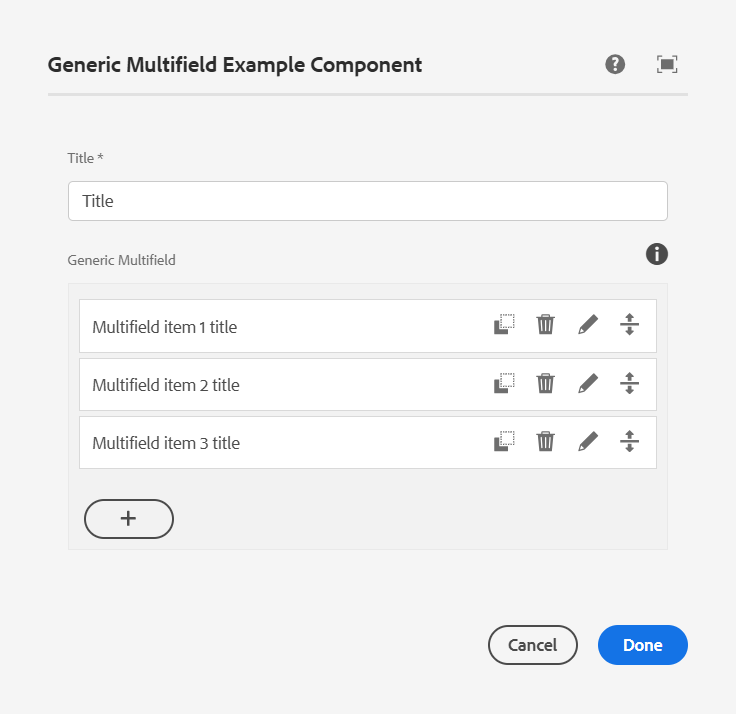
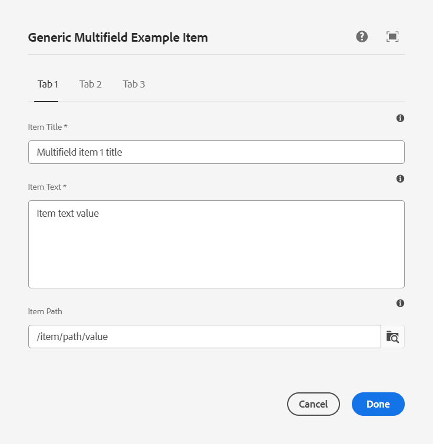
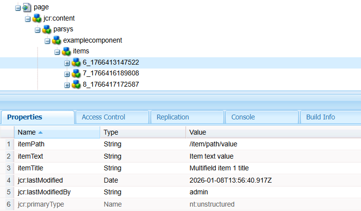

# AEM Generic Multifield

<p align="center">
    <a href="https://maven-badges.sml.io/sonatype-central/com.merkle.oss.aem/aem-generic-multifield/">
        </a>
    <a href="https://javadoc.io/doc/com.merkle.oss.aem/aem-generic-multifield.core-bundle">
        </a>
    <a href="https://sonarcloud.io/summary/overall?id=merkle-open_aem-generic-multifield&branch=master">
        </a>
    <a href="https://sonarcloud.io/summary/overall?id=merkle-open_aem-generic-multifield&branch=master">
        </a>
    <a href="https://sonarcloud.io/summary/overall?id=merkle-open_aem-generic-multifield&branch=master">
        </a>
    <a href="https://sonarcloud.io/summary/overall?id=merkle-open_aem-generic-multifield&branch=master">
        </a>
    <a href="https://sonarcloud.io/summary/overall?id=merkle-open_aem-generic-multifield&branch=master">
        </a>    
    <a href="https://sonarcloud.io/summary/overall?id=merkle-open_aem-generic-multifield&branch=master">
        </a>
    <a href="https://github.com/merkle-open/aem-generic-multifield/actions/workflows/verify-snapshot.yml">
        </a>
    <a href="https://github.com/merkle-open/aem-generic-multifield/actions/workflows/deploy-snapshot.yml">
        </a>
</p>

The **Generic Multifield** is a Coral UI extension for AEM that provides a robust solution for complex multifield dialog
definitions. It serves as a superior alternative when the out-of-the-box
`granite/ui/components/coral/foundation/form/multifield` lacks the necessary flexibility or fails to provide an adequate
user experience for content authors. This component is particularly effective for dialogs requiring complex UI
elements—such as Rich Text Editors or Image properties—and supports the implementation of custom validation rules.
Furthermore, the Generic Multifield supports nesting, allowing for the management of hierarchical data
structures.

## Generic Multifield Example Component

The project contains an example component implementation that demonstrates the usage of the Generic Multifield.

- Resource
  type: [examplecomponent](ui.apps/src/main/content/jcr_root/apps/merkle/generic-multifield/example/components/examplecomponent)
- Model: [ExampleComponent](core/src/main/java/com/merkle/oss/aem/genericmultifield/example/components)

<div align="center">

| Description                                | Preview                                          |
|--------------------------------------------|--------------------------------------------------|
| [Component Dialog](#dialog-definition)     |           |
| [Multifield Item Dialog](#item-definition) |  |
| Repository structure                       |       |

</div>

## Installation

### Maven Dependency

Add the `aem-generic-multifield.all` artifact to the `<dependencies>` section

```xml

<dependency>
    <groupId>com.merkle.oss.aem</groupId>
    <artifactId>aem-generic-multifield.all</artifactId>
    <version>4.0.1</version>
    <type>zip</type>
</dependency>

```

### Package embedding

Embed the package into your `all` deployment module using the `filevault-package-maven-plugin`:

```xml

<embedded>
    <groupId>com.merkle.oss.aem</groupId>
    <artifactId>aem-generic-multifield.all</artifactId>
    <target>/apps/{your/install/path}/install</target>
</embedded>

```

### Dialog definition

Example property defintion of the Generic Multifield in your component `_cq_dialog.xml` definition:

```xml
<?xml version="1.0" encoding="UTF-8"?>
<jcr:root>
    <!-- Within the component dialog definition -->
    ...
    <title
            jcr:primaryType="nt:unstructured"
            sling:resourceType="granite/ui/components/coral/foundation/form/textfield"
            fieldLabel="Title"
            name="./title"/>
    <genericMultifield
            jcr:primaryType="nt:unstructured"
            sling:resourceType="merkle/generic-multifield/authoring/ui/components/multifield"
            itemDialog="/your/project/path/component/item-dialog.xml"
            fieldLabel="Generic Multifield"
            fieldDescription="A list of generic multifield items"
            itemNameProperty="itemTitle"
            minElements="2"
            maxElements="5"
            required="{Boolean}true"
            allowItemCopy="{Boolean}true"
            itemStorageNode="./items"/>
    ...
</jcr:root>
```

#### Properties

| Property         | Description                                                                                                                                 | Default     |
|------------------|---------------------------------------------------------------------------------------------------------------------------------------------|-------------|
| itemDialog       | Path reference to the dialog definition of a generic multifield item.                                                                       | -           |
| itemNameProperty | Defines the value representation of a generic multifield entry within the component dialog. Must be a reference to an item dialog property. | `jcr:title` |
| minElements      | Defines the minimal amount of generic multifield entries.                                                                                   | -           |
| maxElements      | Defines the maximal amount of generic multifield entries.                                                                                   | -           |
| required         | If set to `{Boolean}true`, the main component dialog will not validate until at least one item hast been defined.                           | `false`     |
| allowItemCopy    | If set to `{Boolean}true`, defined multifield entries may be copied to the list.                                                            | `false`     |
| itemStorageNode  | Defines the parent node name created within the component node. Generic multifield items will be saved beneath this node.                   | `items`     |

### Item definition

Example definition of the Generic Multifield item in your components `item-dialog.xml` referenced
within `<genericMultifield>` definition via property `itemDialog`:

```xml
<?xml version="1.0" encoding="UTF-8"?>
<jcr:root xmlns:sling="http://sling.apache.org/jcr/sling/1.0"
          xmlns:jcr="http://www.jcp.org/jcr/1.0"
          xmlns:nt="http://www.jcp.org/jcr/nt/1.0"
          jcr:primaryType="nt:unstructured"
          sling:resourceType="cq/gui/components/authoring/dialog"
          jcr:title="Generic Multifield Example Item">
    <content
            jcr:primaryType="nt:unstructured"
            sling:resourceType="granite/ui/components/coral/foundation/tabs">
        <items
                jcr:primaryType="nt:unstructured">
            <tabOne
                    jcr:primaryType="nt:unstructured"
                    sling:resourceType="granite/ui/components/coral/foundation/fixedcolumns"
                    jcr:title="Tab 1"
                    margin="{Boolean}true">
                <items
                        jcr:primaryType="nt:unstructured">
                    <column
                            jcr:primaryType="nt:unstructured"
                            sling:resourceType="granite/ui/components/coral/foundation/container">
                        <items
                                jcr:primaryType="nt:unstructured">
                            <itemTitle
                                    jcr:primaryType="nt:unstructured"
                                    sling:resourceType="granite/ui/components/coral/foundation/form/textfield"
                                    fieldLabel="Item Title"
                                    fieldDescription="Item Title Description"
                                    required="{Boolean}true"
                                    name="./itemTitle"/>
                            <itemText
                                    jcr:primaryType="nt:unstructured"
                                    sling:resourceType="granite/ui/components/coral/foundation/form/textarea"
                                    fieldLabel="Item Text"
                                    fieldDescription="Item Text Description"
                                    name="./itemText"/>
                            <itemPath
                                    jcr:primaryType="nt:unstructured"
                                    sling:resourceType="granite/ui/components/coral/foundation/form/pathbrowser"
                                    fieldLabel="Item Path"
                                    fieldDescription="Item Path Description"
                                    name="./itemPath"/>
                        </items>
                    </column>
                </items>
            </tabOne>
            <tabTwo
                    jcr:primaryType="nt:unstructured"
                    sling:resourceType="granite/ui/components/coral/foundation/fixedcolumns"
                    jcr:title="Tab 2"
                    margin="{Boolean}true">
                <items
                        jcr:primaryType="nt:unstructured">
                    <column
                            jcr:primaryType="nt:unstructured"
                            sling:resourceType="granite/ui/components/coral/foundation/container">
                        <items
                                jcr:primaryType="nt:unstructured">

                            <!-- properties definition -->

                        </items>
                    </column>
                </items>
            </tabTwo>
            <tabThree
                    jcr:primaryType="nt:unstructured"
                    sling:resourceType="granite/ui/components/coral/foundation/fixedcolumns"
                    jcr:title="Tab 3"
                    margin="{Boolean}true">
                <items
                        jcr:primaryType="nt:unstructured">
                    <column
                            jcr:primaryType="nt:unstructured"
                            sling:resourceType="granite/ui/components/coral/foundation/container">
                        <items
                                jcr:primaryType="nt:unstructured">

                            <!-- properties definition -->

                        </items>
                    </column>
                </items>
            </tabThree>
        </items>
    </content>
</jcr:root>
```

## Development

Build the full package

```
    mvn clean install -PautoInstallBundle
```

Build and deploy the full package to a local AEM Author:

```
    mvn clean install -PautoInstallPackage
```

## Compatibility & Requirements

### AEM Version

This tool requires **AEM Version 2025.9.x** or higher.

### Platform Support

- **AEM as a Cloud Service (AEMaaCS):** This tool is primarily designed and optimized for Cloud Service environments.
- **AEM On-Premise / Adobe Managed Services:** While the codebase is compatible with standard AEM On-Premise
  installations, please note that it has not been formally tested in these environments.
