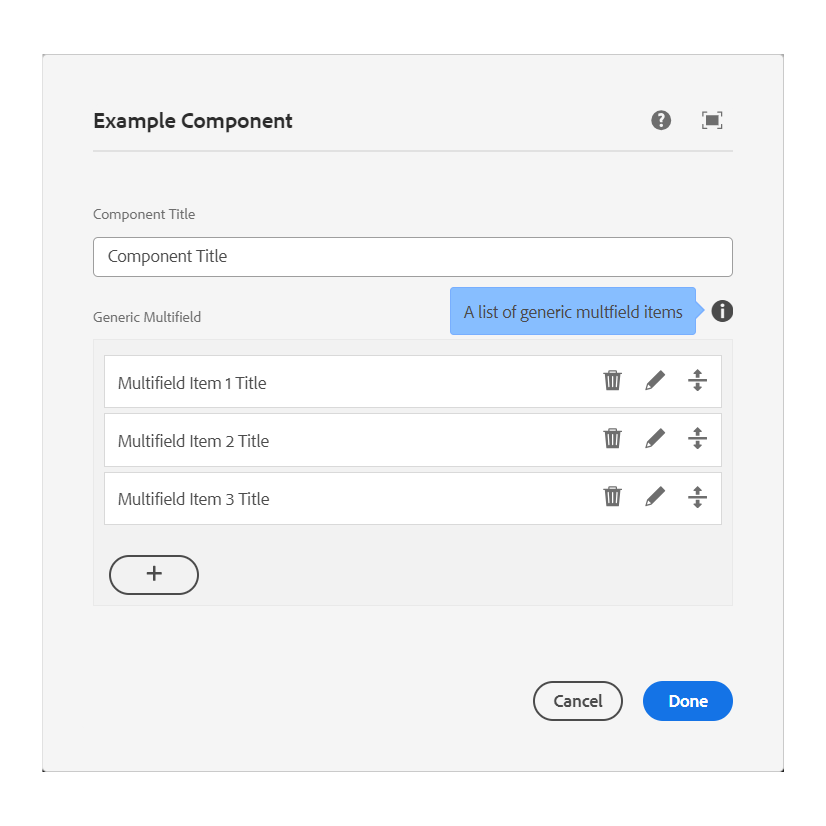

# Generic Multifield for AEMaaCS

With this project you can use a widget
in [AEM as a Cloud Service](https://experienceleague.adobe.com/docs/experience-manager-cloud-service/content/release-notes/home.html)
Touch UI which lets you create a generic multifield in a dialog.

| System     | Status                                                                                                                                                                                                                                                          |
|------------|-----------------------------------------------------------------------------------------------------------------------------------------------------------------------------------------------------------------------------------------------------------------|
| CI master  | [](https://github.com/merkle-open/aem-generic-multifield/actions/workflows/release-and-deploy-release.yml) |
| CI develop | [](https://github.com/merkle-open/aem-generic-multifield/actions/workflows/deploy-snapshot.yml)                         |
| Dependency | [](https://maven-badges.herokuapp.com/maven-central/com.namics.oss.aem/genericmultifield)                                                      |

<!-- TOC -->
* [Generic Multifield for AEMaaCS](#generic-multifield-for-aemaacs)
  * [Requirements](#requirements)
  * [Maven Dependency](#maven-dependency)
  * [in AEM](#in-aem)
    * [Component Dialog](#component-dialog)
      * [Properties](#properties)
    * [Item-Dialog](#item-dialog)
    * [Repository](#repository)
  * [Development](#development)
<!-- TOC -->

## Requirements

| System  | Version                                                                                                                                                                |
|---------|------------------------------------------------------------------------------------------------------------------------------------------------------------------------|
| AEMaaCS | min version: [2023.12.0](https://experienceleague.adobe.com/en/docs/experience-manager-cloud-service/content/release-notes/release-notes/2023/release-notes-2023-12-0) |

## Maven Dependency

```
    <dependency>
      <groupId>com.namics.oss.aem</groupId>
      <artifactId>genericmultifield</artifactId>
      <version>4.0.0-SNAPSHOT</version>
    </dependency>
```

## in AEM

Since the Generic Multifield is built as an OSGi bundle, only the bundle has to be installed into your AEM instance.
With the common AEM archetype it can be added within the embedded configuration of the `content-package-maven-plugin`
plugin.

```xml

<plugin>
    <groupId>com.day.jcr.vault</groupId>
    <artifactId>content-package-maven-plugin</artifactId>
    <extensions>true</extensions>
    <configuration>
        ...
        <embeddeds>
            <embedded>
                <groupId>com.namics.oss.aem</groupId>
                <artifactId>genericmultifield</artifactId>
                <target>/apps/myProject/install</target>
            </embedded>
        </embeddeds>
    </configuration>
</plugin>
```

### Component Dialog

Example usage of the Generic Multifield in your component `_cq_dialog.xml` definition within AEM:

```xml
<!-- Within the component dialog definition -->
<jcr:root
  ...
    <title
      jcr:primaryType="nt:unstructured"
      sling:resourceType="granite/ui/components/coral/foundation/form/textfield"
      fieldLabel="Title"
      name="./title"/>
    <genericmultifield
      jcr:primaryType="nt:unstructured"
      sling:resourceType="merkle/genericmultifield"
      itemDialog="/your/project/path/component/item-dialog.xml"
      fieldLabel="Generic Multifield"
      fieldDescription="A list of generic multfield items"
      itemNameProperty="itemTitle"
      minElements="2"
      maxElements="5"
      required="{Boolean}true"
      itemStorageNode="./items"/>
  ...
</jcr:root>
```

#### Properties

| Property             | Function                                                                                                                                          |
|----------------------|---------------------------------------------------------------------------------------------------------------------------------------------------|
| **itemDialog**       | Path reference to the dialog definition of a generic multifield item.                                                                             |
| **itemNameProperty** | Defines the value representation of a generic multifield entry within the component dialog. Must be a reference to an item dialog property.       |
| **minElements**      | Defines the minimal amount of generic multifield entries.                                                                                         |
| **maxElements**      | Defines the maximal amount of generic multifield entries.                                                                                         |
| **required**         | If set to `{Boolean}true`, the main component dialog will not validate until at least one item hast been defined.                                 |
| **itemStorageNode**  | Defines the parent node name created within the component node. Generic multifield items will be saved beneath this node <br/>(default: `items`). |



### Item-Dialog

Example definition of the Generic Multifield item in your component's `item-dialog.xml` referenced
within `<genericmultifield>` definition via property `itemDialog`:

```xml
<?xml version="1.0" encoding="UTF-8"?>
<jcr:root xmlns:sling="http://sling.apache.org/jcr/sling/1.0"
          xmlns:jcr="http://www.jcp.org/jcr/1.0"
          xmlns:nt="http://www.jcp.org/jcr/nt/1.0"
          jcr:primaryType="nt:unstructured"
          sling:resourceType="cq/gui/components/authoring/dialog"
          jcr:title="Generic Multifield Item">
    <content
            jcr:primaryType="nt:unstructured"
            sling:resourceType="granite/ui/components/coral/foundation/tabs">
        <items
                jcr:primaryType="nt:unstructured">
            <tabOne
                    jcr:primaryType="nt:unstructured"
                    sling:resourceType="granite/ui/components/coral/foundation/fixedcolumns"
                    jcr:title="Tab 1"
                    margin="{Boolean}true">
                <items
                        jcr:primaryType="nt:unstructured">
                    <column
                            jcr:primaryType="nt:unstructured"
                            sling:resourceType="granite/ui/components/coral/foundation/container">
                        <items
                                jcr:primaryType="nt:unstructured">
                            <itemTitle
                                    jcr:primaryType="nt:unstructured"
                                    sling:resourceType="granite/ui/components/coral/foundation/form/textfield"
                                    fieldLabel="Item Title"
                                    fieldDescription="Item Title Description"
                                    required="{Boolean}true"
                                    name="./itemTitle"/>
                            <itemText
                                    jcr:primaryType="nt:unstructured"
                                    sling:resourceType="granite/ui/components/coral/foundation/form/textarea"
                                    fieldLabel="Item Text"
                                    fieldDescription="Item Text Description"
                                    name="./itemText"/>
                            <itemPath
                                    jcr:primaryType="nt:unstructured"
                                    sling:resourceType="granite/ui/components/coral/foundation/form/pathbrowser"
                                    fieldLabel="Item Path"
                                    fieldDescription="Item Path Description"
                                    name="./itemPath"/>

                        </items>
                    </column>
                </items>
            </tabOne>
            <tabTwo
                    jcr:primaryType="nt:unstructured"
                    sling:resourceType="granite/ui/components/coral/foundation/fixedcolumns"
                    jcr:title="Tab 2"
                    margin="{Boolean}true">
                <items
                        jcr:primaryType="nt:unstructured">
                    <column
                            jcr:primaryType="nt:unstructured"
                            sling:resourceType="granite/ui/components/coral/foundation/container">
                        <items
                                jcr:primaryType="nt:unstructured">

                            <!-- properties definition -->

                        </items>
                    </column>
                </items>
            </tabTwo>
            <tabThree
                    jcr:primaryType="nt:unstructured"
                    sling:resourceType="granite/ui/components/coral/foundation/fixedcolumns"
                    jcr:title="Tab 3"
                    margin="{Boolean}true">
                <items
                        jcr:primaryType="nt:unstructured">
                    <column
                            jcr:primaryType="nt:unstructured"
                            sling:resourceType="granite/ui/components/coral/foundation/container">
                        <items
                                jcr:primaryType="nt:unstructured">

                            <!-- properties definition -->

                        </items>
                    </column>
                </items>
            </tabThree>
        </items>
    </content>
</jcr:root>
``` 


### Repository

In the repository the content is stored as follows:


## Development

Build locally with Maven

```
    mvn clean install -PautoInstallBundle
```
