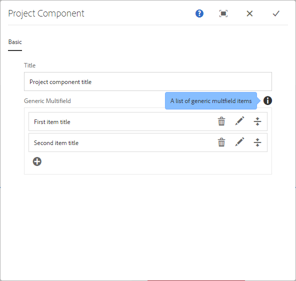

# Generic Multifield for AEM 6.3

With this project you can use a widget in [Adobe Experience Manager 6.3](https://helpx.adobe.com/experience-manager/6-3/release-notes.html) Touch UI which lets you create a generic multifield in a dialog.

## Usage

### Maven Dependency
```
    <dependency>
      <groupId>com.namics.oss.aem</groupId>
      <artifactId>genericmultifield</artifactId>
      <version>0.9.0</version>
    </dependency>
```

### in AEM
#### Dialog
Use the Generic Multifield in your _cq_dialog.xml of a AEM 6.3 (with Touch UI) like this example:
```xml
    <genericmultifield
        jcr:primaryType="nt:unstructured"
        sling:resourceType="namics/genericmultifield"
        fieldLabel="Generic Multifield"
        itemDialog="path/to/a/item-dialog"
        itemStorageNode="items"
        itemNameProperty="title"
        name="./items"
        maxElements="5"/>
```

Example dialog:



#### Item-Dialog
The referenced item-dialog needs "namics/genericmultifield/item-dialog" as the sling:resourceType:
```xml
    <jcr:root xmlns:sling="http://sling.apache.org/jcr/sling/1.0"
            xmlns:jcr="http://www.jcp.org/jcr/1.0"
            xmlns:nt="http://www.jcp.org/jcr/nt/1.0"
            jcr:primaryType="nt:unstructured"
            jcr:title="Item Dialog"
            sling:resourceType="namics/genericmultifield/item-dialog">
            <!-- normal Granite UI dialog definition comes here !-->
    </jcr:root>
``` 

Example item dialog:


#### Storage
In the reporsitory the content is stored like this:


### Requirements
* AEM 6.3 with Touch UI

### Development
Build locally with Maven
```
    mvn clean install -PautoInstallBundle
``` 
